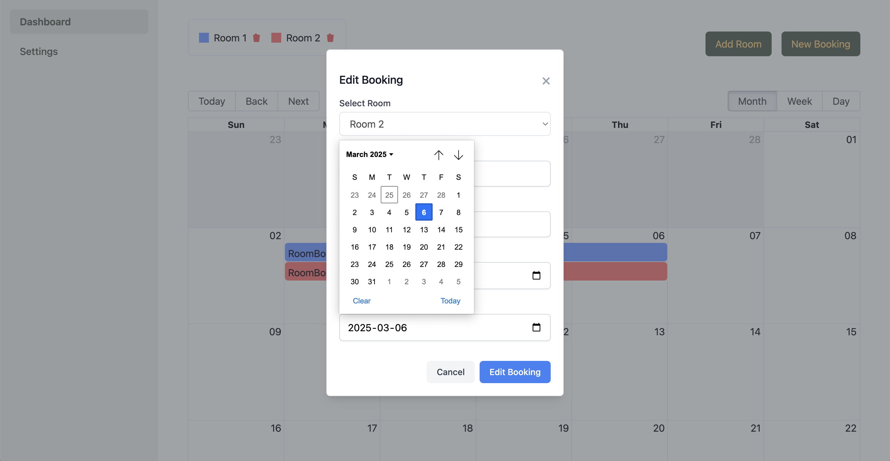

# RoomBook

A simple yet elegant accommodation booking management system built to help small lodging businesses manage their rooms and reservations.

## Overview

RoomBook is a personal project designed to solve the challenges of managing room bookings for small hotels, bed and breakfasts, or vacation rentals. The application provides a clean, intuitive interface for viewing and managing room availability through an interactive calendar.

*URL*: https://booking-manager-lake.vercel.app/

## Screenshots

### Login

### Dashboard

### Calendar View

### Create Room

### Create Booking

### Booking Detail

### Edit Booking

## Key Features

- **Room Management**: Create rooms with custom color coding for easy identification
- **Booking Calendar**: Visual monthly/weekly/daily calendar view of all reservations
- **Customer Tracking**: Store guest information with each booking
- **Booking Management**: Create, edit, and delete bookings with just a few clicks
- **User Authentication**: Secure access to your booking data

## Technical Details

### Frontend

- Built with React.js and styled with TailwindCSS
- Interactive calendar using react-big-calendar
- Secure authentication with react-auth-kit
- Custom color picker for room color assignment

### Backend

- Node.js and Express.js REST API
- PostgreSQL database for data storage
- JWT-based authentication
- Secure password hashing with bcrypt

## Implementation Notes

- The calendar component uses color-coding based on room colors to easily distinguish between different room bookings
- Fixed a bug where bookings would sometimes appear in black when rooms weren't fully loaded by updating the effect dependencies

## Learnings & Challenges

During development, I encountered and solved several interesting challenges:

- Properly synchronizing the rooms and bookings data to ensure correct color display
- Implementing a user-friendly date range selection for bookings
- Creating an intuitive UI for managing room colors
- Authentication bug fixing when deploying

## Future Improvements

Some features I'm considering adding in the future:

- Statistical dashboard showing occupancy rates
- Email notifications for new bookings
- Customer management system
- Payment integration

## Contact

GitHub: [kosunghw](https://github.com/kosunghw)

---

This project was created as a personal portfolio project to demonstrate full-stack development skills.
